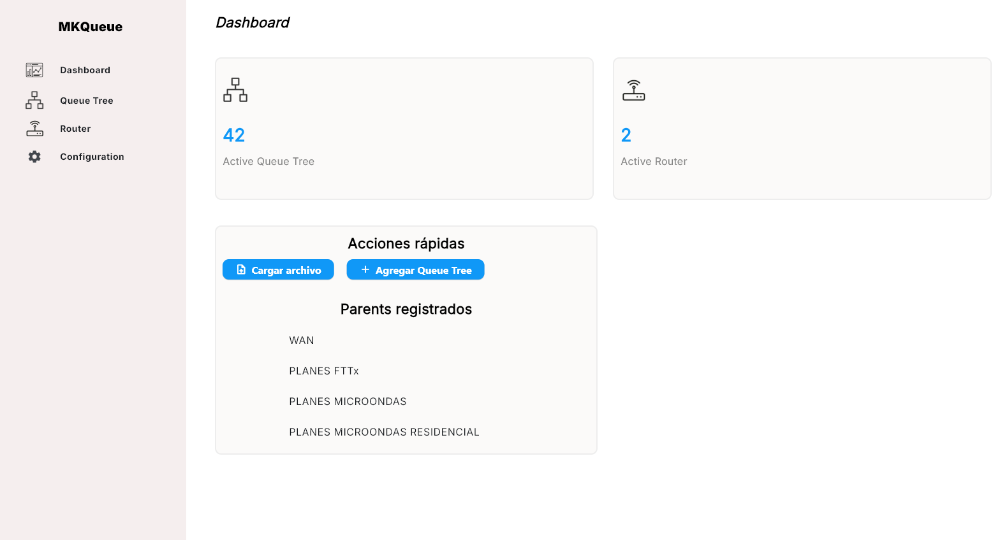
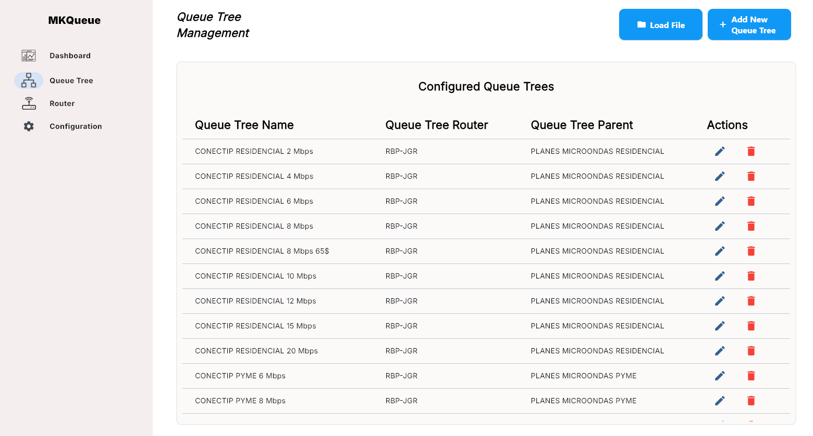
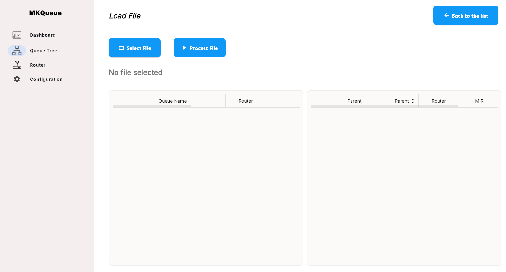
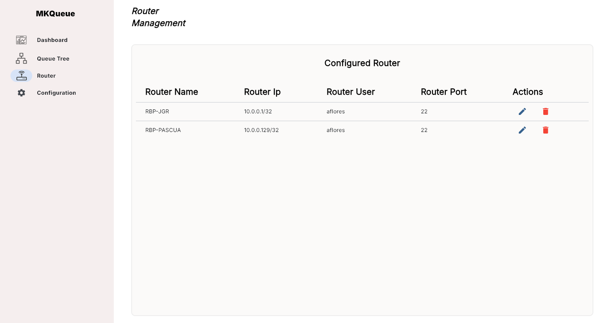
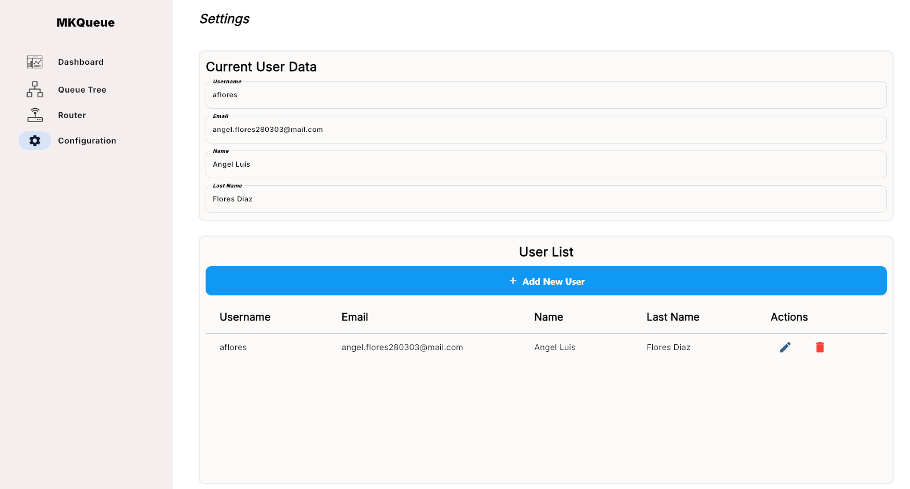

# MKQueue

**Sistema de Automatización para actualización de cálculos y sincronización en routers Mikrotik, compatible con contratos Wispro**

---

## Descripción

MKQueue es una aplicación de escritorio desarrollada en Python con Flet para la gestión avanzada de colas de tráfico en routers Mikrotik. Permite importar datos, calcular y visualizar jerarquías de colas, gestionar routers, usuarios y configuraciones, todo con una interfaz moderna y segura.

---

## Características Principales

- **Autenticación segura** y gestión de usuarios (CRUD)
- **Gestión visual de Queue Trees** y jerarquía de padres/hijos
- **Carga y procesamiento de archivos CSV/Excel** para automatizar la creación de colas
- **Cálculo automático de MIR/CIR** con agregación recursiva en la jerarquía de padres
- **Gestión de Routers Mikrotik** (multi-router)
- **Panel de acciones rápidas** y resumen de datos clave en el dashboard
- **Visualización de padres registrados** y navegación rápida
- **Interfaz moderna y responsiva** con Flet

---

## Estructura del Proyecto

```
MKQueue/
├── main.py                 # Punto de entrada de la aplicación
├── Database/               # Módulo de base de datos
│   ├── init_db.py          # Inicialización y creación de tablas
│   └── querys.py           # Funciones de consulta
├── Pages/                  # Páginas principales y subpáginas
│   ├── Login.py
│   ├── dashboard.py
│   ├── QueueTree.py
│   ├── Router.py
│   ├── Settings.py
│   ├── load_file.py
│   └── Sub_Pages/
│       ├── Add_New_User.py
│       ├── Add_Router.py
│       └── Add_Queue_tree.py
├── Objects/                # Funciones y componentes reutilizables
│   ├── Global_Function.py
│   ├── Navigation_Bar.py
│   ├── Settings_Function.py
│   ├── Router_Function.py
│   └── Queue_Tree_Function.py
├── Styles/                 # Estilos y temas
│   └── styles.py
├── Recursos/               # Recursos estáticos (iconos, fuentes, capturas)
│   ├── Fuentes/
│   ├── Iconos/
│   └── Capturas/           # (Agrega aquí tus capturas de pantalla)
├── Variables.json          # Configuración inicial del sistema
└── README.md
```

---

## Funcionalidades Detalladas

### 🔐 Autenticación y Seguridad
- Login seguro con PostgreSQL
- Protección de rutas en todas las páginas
- Gestión de usuarios desde Settings

### 🖥️ Interfaz de Usuario
- Navegación lateral intuitiva
- Panel de acciones rápidas (cargar archivo, agregar queue tree)
- Visualización de estadísticas clave (cantidad de queue trees y routers)
- Lista de padres registrados en el dashboard

### 🗄️ Gestión de Datos y Operaciones
- Importación de archivos para crear colas masivamente
- Procesamiento y validación de datos de queue tree
- Cálculo automático de MIR y CIR, con agregación recursiva en la jerarquía de padres
- Visualización de jerarquía y sumatorias en tablas scrollables

### 🌳 Queue Tree Management
- Crear, editar y eliminar queue trees
- Visualización jerárquica de padres e hijos
- Sincronización con routers

### 🛰️ Router Management
- Alta, edición y eliminación de routers Mikrotik
- Configuración de credenciales y puertos
- Monitoreo de estado

### ⚙️ Settings
- Visualización y edición de datos del usuario activo
- Administración de usuarios del sistema

---

## Instalación y Configuración

1. **Clonar el Repositorio**
   ```bash
   git clone https://github.com/ALFD03/MKQueue
   cd MKQueue
   ```

2. **Instalar Dependencias**
   ```bash
   pip install -r requirements.txt
   ```

3. **Configurar Variables de Entorno**
   - Crear un archivo `.env` en la raíz del proyecto con los datos de conexión a PostgreSQL.

4. **Configurar Variables.json**
   - Define routers, padres, planes y usuarios iniciales.

5. **Inicializar Base de Datos**
   ```bash
   python Database/init_db.py
   ```

6. **Ejecutar la Aplicación**
   ```bash
   python main.py
   ```

---

## Estructura de Base de Datos

Incluye tablas para usuarios, routers, padres y queue trees, con relaciones jerárquicas y claves foráneas.

---

## Uso del Sistema

- **Dashboard**: Resumen de colas y routers, acciones rápidas, lista de padres.
- **Queue Tree**: Gestión visual y jerárquica de colas.
- **Routers**: Administración de routers Mikrotik.
- **Settings**: Gestión de usuarios y configuración.

---

## Ejemplo de Uso y Capturas de Pantalla

### Dashboard principal


### Gestión de Queue Trees


### Carga de archivo y vista previa


### Gestión de Routers


### Configuración y usuarios


---

## Créditos

Desarrollado por Angel Flores.  
Basado en Python, Flet y PostgreSQL.

